# Hi there 👋
I'm **Aaryan Porwal** a passionate developer and currently a third year computer science student!
- Previously Google Summer of Code '21(GSoC) at Ceph 🐙 .
- Recurse Center alum (Spring 2 '21 Batch)  .
- Things I love talking about: GNU/linux, C/C++, Computer Networks and Coffee ☕️.
-  How to reach me: 📧 aaryanporwal2233 [at] gmail [dot] [com], or find me on @aaryan7476:matrix.org 🕸️.

## Metrics

